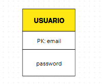
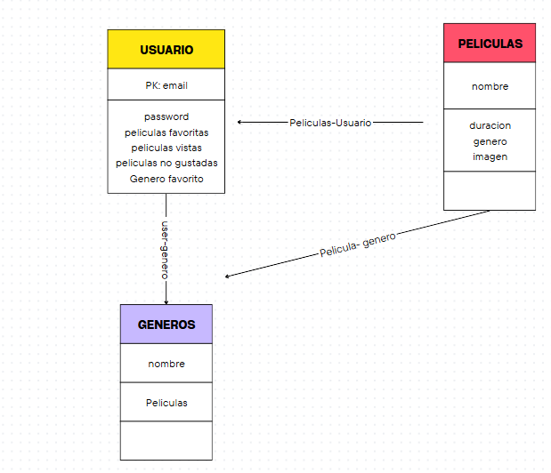

# user-management

# PRUEBA TECNICA 
# NELSON STEVEN RODRIGUEZ ORTIZ 

#DESARROLADOR NODE JS

**En este archivo se muestra la configuracion que se uso para la base de datos MySQL:**

ARCHIVO .env

NODE_ENV=production
DB_HOST="127.0.0.1"
DB_USER=admin
DB_PORT=3306
DB_PASS=wuHd6Q65O=^~h
DB_NAME=user_management
DB_DIALECT=mysql
JWT_SECRET=miclaveultrasecreta
PORT=4000

** CONFIGURACION DEL PROYECTO**

ejecución de Scripts 

-npm install
-npm start

todas dependencias ya estas ajustadas y modificadas para funcionar directamente

** Funcionalidades y scripts**

http://localhost:4000/auth/register 

// Permite el registro de un nuevo usuario
// Metodo POST: 
// recibe {"email": "steven@example.com", "password": "12345"}

http://localhost:4000/auth/login 

// Permite el login de un usuario registrado
// Metodo POST: 
// recibe {"email": "steven@example.com", "password": "12345"}

http://localhost:4000/health

// Permite verificar el estado actual del servidor y su conexion a la base de datos
// Metodo GET: 
// genera {"status":"ok","timestamp":"2024-12-11T15:47:58.703Z","dbConnection":"ok"}

http://localhost:4000/api-docs/

// Swagger generado con swagger UI & swagger-autogen permite la validacion de los scritps directamente

** BASES DE DATOS Y MANEJO DE ORM **

// El ORM se encargará de crear la tabla en la base de datos en caso de esta no existir con los requerimientos necesarios
// al ser una aplicacion sencilla consta solamente de una tablar de dos columnas usario como la primary key del login siendo esta única-contraseña
//

// Motivos por los que se opto por una base de datos SQL respecto a una NoSQL

Aunque en este caso al ser una aplicación pequeña la base de datos puede cambiar entre una y otra se optó por una base de datos SQL dado que:
1. Los datos como usuario y sistemas de login tienen a ser datos altamente estructurados, las bases de datos SQL permitiria crear relaciones entre los usuarios 
creados en el login y el resto de componente que se decidiera añadir a la aplicacion
2. Permite crear relaciones complejas que son utlizadas constantemente en aplicaciones de manejo de usuarios permitiendo relacionar los usuarios con el resto de interacciones
dentro de la apliacion
 
 **Diagrama de un ejemplo de uso de la aplicacion de login en una aplicacion de peliculas**

 

 3. Las bases de datos SQL se garantiza los principios ACID asegurando una mayor cosistencia hacia la perdida, modificacion y manejo de los datos, aspecto muy importante y crucial
 en el manejo de datos sencibles como lo son usuarios.
 4. Familiaridad. 

 
** TESTING **

// Se utilizo JEST para la creacion de los Test
// Actualmente se tiene una covertura del 90% del codigo para no hacer redundante la comprobación de la conexión  a la base de datos

scripts:

-npm test 

o 

-node --experimental-vm-modules node_modules/jest/bin/jest.js //Se utiliza la ejecución de esta manera para no tener incompatiblidades con ESM

 
** DOCKER **

// Se creo una contenedor docker que permite el despliegue de la aplicacion y los testing

script 

-docker-compose up --build

// Quiero expresar mi sincero agradecimiento por la oportunidad dada durante este proceso. Reconozco el compromiso de cada uno y espero que el resultado sea positivo.
// Estoy atento a resolver cualquier duda.
// Muchas gracias.